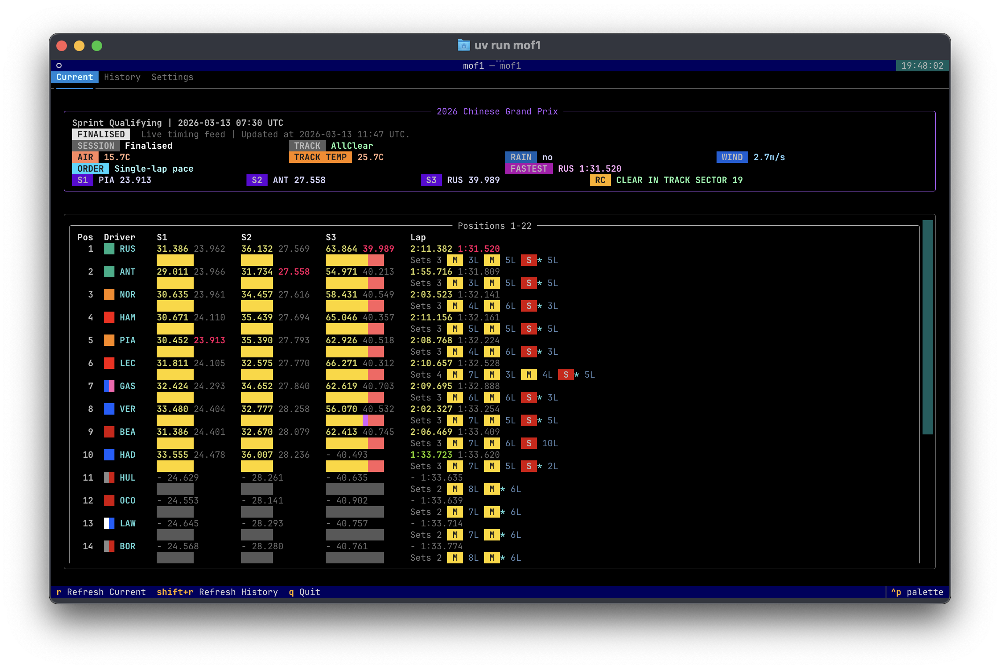

<div align="center">
  
  <h1>mof1</h1>
  <p><strong>A polished Formula 1 terminal dashboard built with Textual.</strong></p>
  <p>Live timing for the current session. FastF1-backed history when you want to look back.</p>
  <p>
    <a href="https://github.com/jingfelix/mof1/actions/workflows/ci.yml"></a>
    <a href="https://github.com/jingfelix/mof1/blob/main/LICENSE"></a>
    
    
    
    
  </p>
</div>

## Overview

`mof1` is a terminal-first Formula 1 dashboard for people who prefer a fast, information-dense board over a browser tab.

It combines two data paths:

- `Current`: anonymous F1 live timing feed for the latest session state
- `History`: `FastF1` for season, event, and session browsing with local cache

The result is a compact TUI that gives you a timing tower, sector pace, mini-sector colors, tyre usage, weather, and session context in one screen.

<table>
  <tr>
    <td width="50%" valign="top">
      <strong>Current</strong><br />
      Anonymous live timing feed with direct startup, no FastF1 bootstrap.<br />
      <br />
      <code>Remain</code>, track status, weather, best sectors, mini-sectors, tyre stints, and lap pace update inside the live board.
    </td>
    <td width="50%" valign="top">
      <strong>History</strong><br />
      FastF1-backed browser for past sessions.<br />
      <br />
      Pick a season, event, and session, then inspect the same driver-focused layout with local caching under <code>~/.cache/mof1/fastf1</code>.
    </td>
  </tr>
</table>

## Highlights

- Single-screen timing tower designed for terminal use, not a web page squeezed into a shell.
- Live `Current` page starts from the anonymous F1 timing feed directly.
- `History` page stays on FastF1, with cached session data and manual refresh.
- Sector values show current vs reference pace with color semantics for session-best, driver-best, and non-best laps.
- Mini-sector strips make pace changes readable at a glance.
- Tyre stints are shown inline, including compound order and lap counts.
- Summary section surfaces session state, weather, fastest lap, best sectors, and race control context.
- Team swatches are always visible; team names can be toggled in `Settings`.

## Install

### Run from source

```bash
git clone https://github.com/jingfelix/mof1.git
cd mof1
uv sync
uv run mof1
```

### Environment

- Python `3.10+`
- [`uv`](https://docs.astral.sh/uv/)
- A terminal with decent truecolor support is recommended

## Usage

```bash
uv run mof1
```

### Keyboard

| Key | Action |
| --- | --- |
| <kbd>r</kbd> | Reconnect the current live feed |
| <kbd>Shift</kbd> + <kbd>r</kbd> | Refresh the selected history session |
| <kbd>q</kbd> | Quit |
| <kbd>Ctrl</kbd> + <kbd>C</kbd> | Quit |


### Tabs

- `Current`: live board for the active or latest available session
- `History`: season / event / session browser backed by FastF1
- `Settings`: UI preferences such as showing or hiding team names

## Data Sources

| Page | Source | Notes |
| --- | --- | --- |
| `Current` | Anonymous F1 live timing feed | Used for live timing, sectors, mini-sectors, weather, track status, and tyre app data |
| `History` | `FastF1` | Used for schedule lookup, cached session loading, and historical timing snapshots |

`mof1` is not an official Formula 1 product. The live feed is an anonymous endpoint and may change or become unavailable without notice.

## Development

### Core commands

```bash
uv run ruff format .
uv run ruff check .
uv run ty check
uv run pytest
uv run python -m compileall src tests
```

### Git hooks

```bash
uv run prek install
uv run prek run --all-files
```

The hook chain checks formatting, lint, types, tests, lockfile freshness, and exported `requirements.txt`.

### CI

GitHub Actions runs on every `push` and `pull_request` and validates:

- `uv lock --check`
- exported `requirements.txt`
- `ruff format --check .`
- `ruff check .`
- `ty check`
- `pytest`
- `python -m compileall src tests`

<details>
  <summary><strong>Project layout</strong></summary>

```text
src/mof1/
  app.py                 Textual app entry
  core/models.py         shared models
  data/fastf1_service.py FastF1 history service
  live_timing/client.py  anonymous live timing client
  ui/render.py           Rich/Textual rendering
```

</details>

## Notes

- First history load is slower because FastF1 needs to populate cache.
- `Current` uses direct live timing; `History` is intentionally conservative and cached.
- The app limits FastF1 request rate and suppresses noisy console logging so the TUI stays clean.
- If the live feed is unavailable, `Current` will show the connection state and you can retry with <kbd>r</kbd>.

## Acknowledgements

- [`FastF1`](https://github.com/theOehrly/Fast-F1)
- [`Textual`](https://textual.textualize.io/)
- Formula 1 live timing data, used here for personal open-source tooling and experimentation
